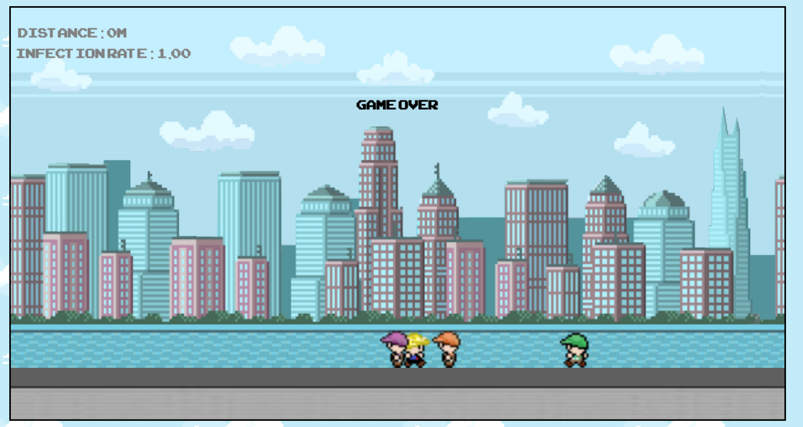
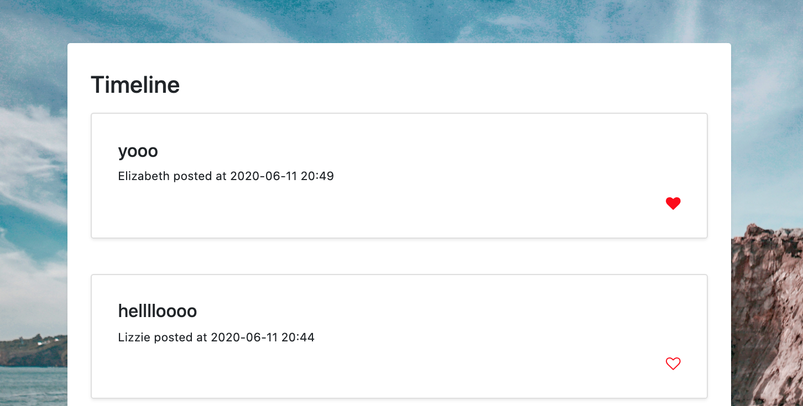
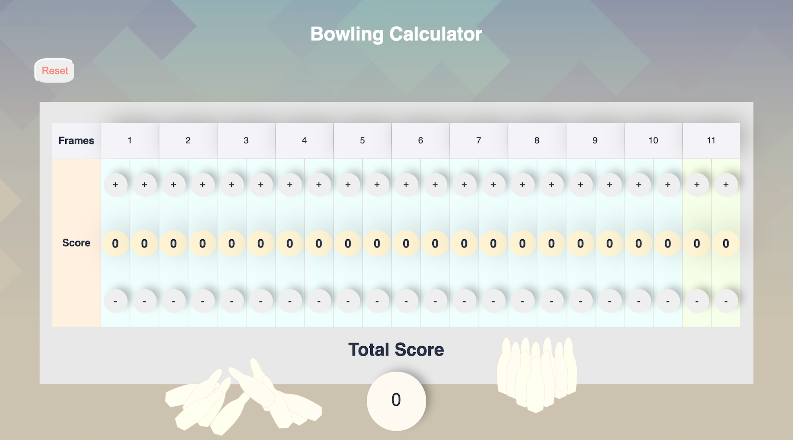

# Lizzie Turney

Junior full-stack developer with an entrepreneurial flair for creating eye-catching web apps! I'm best described as a bubbly, carbonara-lover, who never falters from being optimistic. Friends and colleagues consider me to be a very strong communicator (except when the term "groovy" occasionally slips out). I have experience in front-end, back-end, test-driven and database technologies. I lean towards front-end design due to the scope of creativity it allows. However, I enjoy every aspect of a full-stack code base and embrace every opportunity to improve my skills.

[PROJECTS](#-projects) || [SKILLS](#-skills) || [EMPLOYMENT EXPERIENCE](#-employment-experience) || [EDUCATION](#-education) || [HOBBIES](#-Hobiies)

# Projects

### Makers Academy Projects ###
|Project|Summary|SnapShot|Team Size|Time|Tech Stack|Testing|Personal Highlights|
|:---|:---|:---|:---|:---|:---|:---|:---|
|[Run Boris Run](https://github.com/LTurns/Covid_Game) Deployment: [https://run-boris-run.netlify.app/](https://run-boris-run.netlify.app/) | Boris sets out to get milk, while facing the trials of lockdown and social distancing.| |6|2 Weeks|Node, React, HTML5, Vanilla Javascript|Jasmine|Bringing this idea to life was a whirlwind of creativity!|
|[Acebook](https://github.com/LTurns/Node4Code)| A modern, minimalist facebook clone with similar capabilities.| |4|2 Weeks|Node, React, Express, CSS/HTML, MongoDB| Cypress, Jest | Learning Node within 2 weeks & being part of a great team was wonderful.|
|[Makers AirBnB](https://github.com/LTurns/makersBnB)| A variation of the popularly used site "Air BnB"|"snapshot"|6|2 Weeks|Ruby, Sinatra, HTML/CSS, PostgreSQL, Bcrypt |RSpec, Capybara, SimpleCov(formatting)| I developed and solidified my Ruby skills|
|[Bowling Calculator](https://github.com/LTurns/bowling-challenge)| An online calculator for keeping score of your bowling game|  |1|4 days|Javascript, JQUERY, HTML, CSS, SVG animation|Jasmine|Loved experimenting with visuals and animation, especially SVG and JQUERY|

### Personal Projects ###

|Project|Summary|Time|Tech Stack|Testing|
|:---|:---|:---|:---|:---|
|Thermostat| | | |//Involve my city front-end design for this one|

 use thermostat to include weather API and design - then put this in personal projects

# Skills

# Employment Experience

**Goji Investment Services** (May 2019 to March 2020)  

*Senior Operations Executive*  
- Consult with our clientele of Investment Managers on a daily basis
- Occasionally utilise SQL to construct  and compile Redash data reports
- Experience in CSS and HTML for drafting automated email templates in Mandril
- Process due diligence (KYC, KYB, AML) for international, corporate and retail investors
- Escalate any breaches or issues identified to the MLRO
- Experience and knowledge in dealing with PEP/Sanctions
- Preparing the CASS reconciliation and processing large client money movements
- Train junior employees

**Leyton UK** (February 2018 to May 2019)   

*Major Accounts Executive*
- In charge of the international cross-selling initiative for UK office
- Developed a deeper understanding of R&D Tax and other UK tax schemes
- Selling the optimisation of R&D Tax Claims to prospects
- Pitching our tax services to FTSE clients and large enterprises (over SMEs)
- Training Junior Sales Executives
- Interviewing future employees
- Achieving sales metrics and revenue targets

-*Commercial Executive*
- Finding company prospects
- Pitching our tax services
- Achieving monthly metrics and targets
- Maintaining sales momentum

**Empire Design** (July 2017 - February 2018)

*Runner and Office Assistant*
- A taster of working for a film/post-production company
- In charge of general office administration
- Took the hard drives to Universal Studios

# Education

#### Makers Academy (March 2020 - July 2020)

- OOP, TDD, MVC, DDD
- Agile Development Process
- Ruby, Sinatra, JavaScript, Node, MongoDB, PostgreSQL
- RSpec, Jasmine, Capybara, Jest, Cypress

#### University of Birmingham (2012 to 2015)

- English Literature and Philosophy, 'Logic and Deductivism',  ‘Politics and Philosophy'
Dissertation: 'literature as a discriminative or biased force when presenting a disabled character.'
- 2:1
- Captained the Girls Squash Team - BUCS Champions
- Had a radio show called “Blondies Breakfast” on Burn FM (Birmingham Radio Station)
- Writer for the University Tab
- Part time job at the Student Union

#### University of Westminster (2016 to 2017)

- Audio Technology, Audio-Visual works on Trailers, Short Films and Animations
- Utilised WWise - an interactive audio solution for games and applications
- Use of XD and Adobe Animate for constructing application prototypes
- Merit
- Part time job at Ashbourne Private School in Kensington

# Hobbies

- Composing music
- Endless brunches or pub lunches
- Tennis with friends
- Listening to vinyl records from the golden oldies

Other qualities include: dog person & cat person, a fan of the US Office and Peep Show, sociable and empathetic, a supportive and easy-going team player and a very hard worker. I have also been said to be a quick learner and thick-skinned (learned from my time in sales!).
